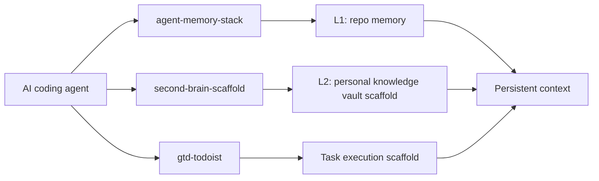

<h1 align="center">sharing-studio</h1>

<p align="center">
  <em>Reusable agent memory, knowledge, and task-system scaffolds.</em>
</p>

<p align="center">
  <a href="./README.md"></a>
  <a href="./README.zh-CN.md"></a>
</p>

> [!NOTE]
> This repository publishes scaffolds only. It intentionally excludes private notes, real task data, local planning files, runtime state, API tokens, and machine-specific paths.

## What's Inside

| Project | Use it when you need | Status |
| :--- | :--- | :--- |
| [`agent-memory-stack`](./projects/agent-memory-stack/) | Persistent memory rules for AI coding agents across Claude Code, Codex, and Gemini CLI. | Stable |
| [`second-brain-scaffold`](./projects/second-brain-scaffold/) | An Obsidian + Basic Memory vault scaffold for AI-assisted ingest, query, lint, and journaling. | Beta |
| [`gtd-todoist`](./projects/gtd-todoist/) | A GTD Todoist harness with agent skills, reminder-only cron jobs, and a health-check auditor. | Beta |

## Architecture



## Quick Start

1. Open the project directory that matches your use case.
2. Read that project's README for dependencies and deployment steps.
3. Copy only the scaffold files you need.
4. Replace placeholders such as `<vault-path>`, `<agent-workspace>`, `<TELEGRAM_USER_ID>`, and `<BOT_ACCOUNT>`.
5. Keep real credentials, task data, notes, and local state outside Git.

## Repository Layout

```text
sharing-studio/
├── projects/
│   ├── agent-memory-stack/          # L1 repo memory router templates
│   ├── second-brain-scaffold/       # L2 Obsidian vault scaffold
│   └── gtd-todoist/                 # Todoist GTD agent harness
├── README.md
├── README.zh-CN.md
└── LICENSE
```

## Design Principles

- **Scaffold over data.** The repository ships structure, guardrails, and workflows, not private content.
- **User approval stays explicit.** Destructive, batch, or high-risk actions are proposal-first.
- **External content is untrusted.** Web pages, API responses, and pasted source material do not go into files that are repeatedly injected as agent instructions.
- **Each project can graduate.** Every scaffold lives under `projects/<name>/` and can be split into a standalone repository later.

## Privacy Boundary

The repo is intended to be safe to publish. These paths are ignored and should remain local:

```text
.claude/
.brv/
task_plan.md
findings.md
progress.md
.env
.env.*
*.key
*.pem
```

Before publishing changes, scan for secrets, real local paths, account IDs, private IPs, and personal content.
