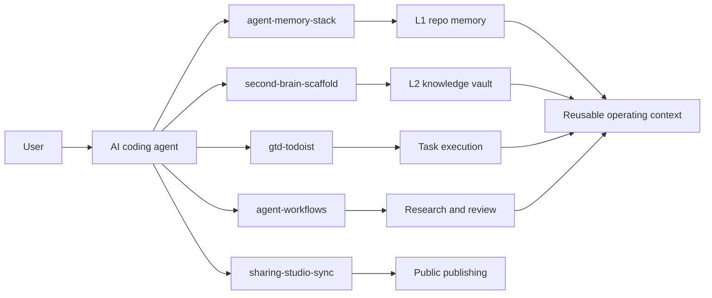

<h1 align="center">sharing-studio</h1>

<p align="center">
  <strong>Public scaffolds for agent memory, knowledge work, GTD, and heavy deployment workflows.</strong>
</p>

<p align="center">
  
  
  
</p>

<!-- README-I18N:START -->
<p align="center">
  <strong>English</strong> | <a href="./README.zh-CN.md">简体中文</a>
</p>
<!-- README-I18N:END -->

> [!NOTE]
> This repository publishes reusable structure only. It intentionally excludes private notes, real task data, local planning files, runtime state, credentials, and machine-specific paths.

## Choose A Scaffold

| Project | Best For | What You Get | Status |
| :--- | :--- | :--- | :--- |
| [`agent-memory-stack`](./projects/agent-memory-stack/) | Persistent agent context across coding sessions | Cross-runtime router templates for Claude Code, Codex, and Gemini CLI | Stable |
| [`second-brain-scaffold`](./projects/second-brain-scaffold/) | AI-assisted personal knowledge vaults | Obsidian, Basic Memory, local skills, hooks, and graph guardrails | Beta |
| [`gtd-todoist`](./projects/gtd-todoist/) | GTD workflows mediated by an agent | Todoist skill contracts, reminder-only cron, and health checks | Beta |
| [`agent-workflows`](./projects/agent-workflows/) | High-stakes deployment planning | Heavy research and heavy review skills with file-backed evidence contracts | Beta |
| [`sharing-studio-sync`](./projects/sharing-studio-sync/) | Publishing this hub from local truth | A guarded sync pipeline for redacted public scaffolds | Experimental |

## Architecture



## Quick Start

1. Pick the project that matches your workflow.
2. Read that project's README for dependencies, expected runtime, and safety boundaries.
3. Copy only the scaffold files you need into your own workspace.
4. Replace placeholders such as `<vault-path>`, `<agent-workspace>`, `<TELEGRAM_USER_ID>`, and `<BOT_ACCOUNT>`.
5. Keep real credentials, notes, task data, and runtime state outside Git.

## Repository Layout

```text
sharing-studio/
├── projects/
│   ├── agent-memory-stack/          # L1 repo memory router templates
│   ├── second-brain-scaffold/       # L2 Obsidian vault scaffold
│   ├── gtd-todoist/                 # Todoist GTD agent harness
│   ├── agent-workflows/             # heavy research and review skills
│   └── sharing-studio-sync/         # guarded publication workflow
├── README.md
├── README.zh-CN.md
└── LICENSE
```

## Design Principles

- **Scaffold over data.** Publish reusable structure, not private content.
- **Explicit user control.** Destructive, batch, or high-risk actions stay proposal-first.
- **External content is untrusted.** Web pages, API responses, and pasted source material do not become persistent agent instructions.
- **Local state stays local.** Runtime files can help worktree coordination, but protected paths must not be pushed.
- **Projects can graduate.** Each scaffold lives under `projects/<name>/` and can later split into a standalone repository.

## Publishing Boundary

The public repo should never contain repo-root runtime state such as:

```text
/.claude/
/.agents/
/.codex/
/.gemini/
/.workflows/
/.brv/
/task_plan.md
/findings.md
/progress.md
/.env
/.env.*
/*.key
/*.pem
```

Before publishing changes, scan for secrets, real local paths, account IDs, private IPs, and personal content.
