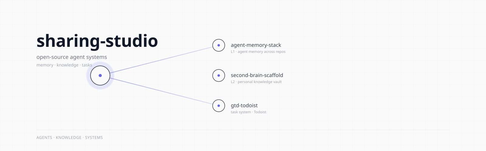
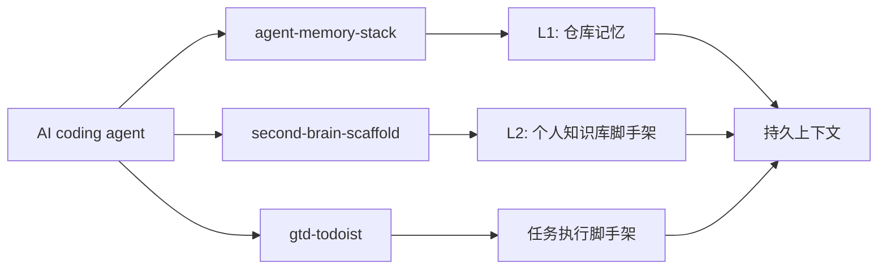

<p align="center">
  <picture>
    <source media="(prefers-color-scheme: dark)" srcset="./assets/banner-dark.svg">
    
  </picture>
</p>

<h1 align="center">sharing-studio</h1>

<p align="center">
  <em>可复用的 agent 记忆、知识库和任务系统脚手架。</em>
</p>

<p align="center">
  <a href="./README.md"></a>
  <a href="./README.zh-CN.md"></a>
</p>

> [!NOTE]
> 这个仓库只发布脚手架。真实笔记、任务数据、本地规划文件、运行时状态、API token 和机器路径都不进入仓库。

## 内容

| 项目 | 适合场景 | 状态 |
| :--- | :--- | :--- |
| [`agent-memory-stack`](./projects/agent-memory-stack/) | 为 Claude Code、Codex、Gemini CLI 等 AI 编程 agent 配置跨 session 记忆规则。 | 稳定 |
| [`second-brain-scaffold`](./projects/second-brain-scaffold/) | 用 Obsidian + Basic Memory 搭建 AI 辅助 ingest、query、lint、journal 的知识库骨架。 | Beta |
| [`gtd-todoist`](./projects/gtd-todoist/) | 基于 Todoist 的 GTD agent 执行脚手架，包含 skills、仅提醒 cron 和健康检查。 | Beta |

## 架构



## 快速开始

1. 进入与你需求匹配的项目目录。
2. 阅读该项目 README，确认依赖和部署步骤。
3. 只复制你需要的脚手架文件。
4. 替换 `<vault-path>`、`<agent-workspace>`、`<TELEGRAM_USER_ID>`、`<BOT_ACCOUNT>` 等占位符。
5. 真实凭据、任务数据、笔记和本地状态必须留在 Git 之外。

## 仓库结构

```text
sharing-studio/
├── assets/                         # 明暗两版 banner
├── projects/
│   ├── agent-memory-stack/          # L1 仓库记忆 router 模板
│   ├── second-brain-scaffold/       # L2 Obsidian vault 脚手架
│   └── gtd-todoist/                 # Todoist GTD agent harness
├── README.md
├── README.zh-CN.md
└── LICENSE
```

## 设计原则

- **发布脚手架，不发布数据。** 仓库只包含结构、护栏和 workflow，不包含私人内容。
- **用户确认是边界。** 破坏性、批量或高风险操作都先提案，再执行。
- **外部内容默认不可信。** Web 页面、API 响应和粘贴素材不能写入会被 agent 反复注入上下文的指令文件。
- **每个项目都能独立毕业。** 所有脚手架都在 `projects/<name>/` 下，未来可拆成独立仓库。

## 隐私边界

以下路径和文件必须保持本地化，不应进入 Git：

```text
.claude/
.brv/
task_plan.md
findings.md
progress.md
.env
.env.*
*.key
*.pem
```

发布前应重新扫描密钥、真实本机路径、账号 ID、私有 IP 和个人内容。
