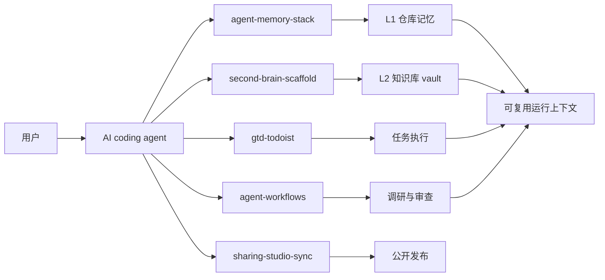

<h1 align="center">sharing-studio</h1>

<p align="center">
  <strong>面向 agent 记忆、知识管理、GTD 和重型部署流程的公开脚手架集合。</strong>
</p>

<p align="center">
  
  
  
</p>

<!-- README-I18N:START -->
<p align="center">
  <a href="./README.md">English</a> | <strong>简体中文</strong>
</p>
<!-- README-I18N:END -->

> [!NOTE]
> 这个仓库只发布可复用结构。真实笔记、真实任务数据、本地规划文件、运行时状态、凭据和机器路径都不会进入公开仓库。

## 选择脚手架

| 项目 | 适合场景 | 你会得到什么 | 状态 |
| :--- | :--- | :--- | :--- |
| [`agent-memory-stack`](./projects/agent-memory-stack/) | 跨编码 session 保持 agent 上下文 | Claude Code、Codex、Gemini CLI 的跨宿主 router 模板 | Stable |
| [`second-brain-scaffold`](./projects/second-brain-scaffold/) | AI 辅助的个人知识库 vault | Obsidian、Basic Memory、本地 skills、hooks 和图谱护栏 | Beta |
| [`gtd-todoist`](./projects/gtd-todoist/) | 由 agent 介导的 GTD 工作流 | Todoist skill 契约、仅提醒 cron 和健康检查 | Beta |
| [`agent-workflows`](./projects/agent-workflows/) | 高风险部署方案规划 | 带文件证据契约的重型调研和重型审查 skills | Beta |
| [`sharing-studio-sync`](./projects/sharing-studio-sync/) | 从本机真源发布这个 hub | 面向脱敏公开脚手架的受保护同步流水线 | Experimental |

## 架构



## 快速开始

1. 选择与你工作流匹配的项目。
2. 阅读该项目 README，确认依赖、目标运行时和安全边界。
3. 只把需要的脚手架文件复制到自己的工作区。
4. 替换 `<vault-path>`、`<agent-workspace>`、`<TELEGRAM_USER_ID>`、`<BOT_ACCOUNT>` 等占位符。
5. 真实凭据、笔记、任务数据和运行时状态必须留在 Git 之外。

## 仓库结构

```text
sharing-studio/
├── projects/
│   ├── agent-memory-stack/          # L1 仓库记忆 router 模板
│   ├── second-brain-scaffold/       # L2 Obsidian vault 脚手架
│   ├── gtd-todoist/                 # Todoist GTD agent harness
│   ├── agent-workflows/             # 重型调研和审查 skills
│   └── sharing-studio-sync/         # 受保护发布工作流
├── README.md
├── README.zh-CN.md
└── LICENSE
```

## 设计原则

- **发布脚手架，不发布数据。** 公开可复用结构，而不是私人内容。
- **用户控制保持显式。** 破坏性、批量或高风险动作都先提案，再执行。
- **外部内容默认不可信。** Web 页面、API 响应和粘贴素材不能变成持久 agent 指令。
- **本地状态留在本地。** 运行时文件可用于 worktree 协作，但受保护路径不得推送。
- **项目可以独立毕业。** 每个脚手架都放在 `projects/<name>/` 下，未来可以拆成独立仓库。

## 发布边界

公开仓库不应包含仓库根级运行状态，例如：

```text
/.claude/
/.agents/
/.codex/
/.gemini/
/.workflows/
/.brv/
/task_plan.md
/findings.md
/progress.md
/.env
/.env.*
/*.key
/*.pem
```

发布前应扫描密钥、真实本机路径、账号 ID、私有 IP 和个人内容。
