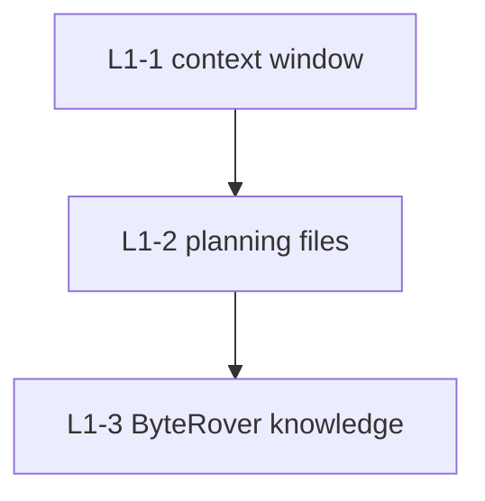

# agent-memory-stack

Router templates for persistent AI coding-agent memory across Claude Code, Codex, and Gemini CLI.

> [!NOTE]
> This project publishes the memory rules and redacted configuration templates only. Real planning files, ByteRover context trees, credentials, and local paths stay outside Git.

## What It Provides

```text
agent-memory-stack/
└── global/
    ├── CLAUDE.md                    # Claude Code global router
    ├── AGENTS.md                    # Codex global router
    ├── GEMINI.md                    # Gemini CLI global router
    └── claude-settings.example.json # Claude Code SessionStart hook example
```

The three router files keep the same body text while using tool-specific H1 titles. They define one memory model that each runtime can follow.

## Memory Model

| Layer | Purpose | Backing store |
| :--- | :--- | :--- |
| L1-1 | Current model context window | Runtime context |
| L1-2 | Session continuity and task state | `task_plan.md`, `progress.md`, `findings.md` |
| L1-3 | Durable per-repo decisions and findings | ByteRover `.brv/context-tree/` |



## Key Rules

- Load planning context at session start when the current directory is inside an L1 repo.
- Keep web, API, and third-party content out of `task_plan.md`; write it to `findings.md` instead.
- Treat `progress.md` as append-only project history.
- Curate long-term knowledge into ByteRover only through the explicit sedimentation workflow.
- In Git worktrees, merge planning files intentionally and avoid concurrent ByteRover writes.

## Quick Start

Copy the router file for the runtime you use:

```powershell
# Claude Code
Copy-Item .\global\CLAUDE.md $HOME\.claude\CLAUDE.md

# Codex
Copy-Item .\global\AGENTS.md $HOME\.codex\AGENTS.md

# Gemini CLI
Copy-Item .\global\GEMINI.md $HOME\.gemini\GEMINI.md
```

For Claude Code, review `global/claude-settings.example.json` before merging the SessionStart hook into a real settings file.

## Dependencies

- `planning-with-files` for Claude Code hook-driven planning-file injection.
- ByteRover CLI (`brv`) if you want the L1-3 long-term layer.
- A runtime that loads the relevant router file at startup.

## Privacy Boundary

Do not publish:

- Real `task_plan.md`, `progress.md`, or `findings.md` files.
- `.brv/` context trees or `.brv` worktree pointer files.
- Provider environment variables, API keys, or auth tokens.
- Machine-specific paths or account identifiers.
