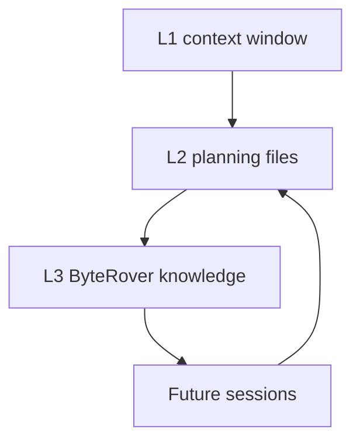

# agent-memory-stack

Persistent memory rules for AI coding agents that need to survive beyond a single chat window.

<p>
  
  
  
</p>

<!-- README-I18N:START -->
<p>
  <strong>English</strong> | <a href="./README.zh-CN.md">简体中文</a>
</p>
<!-- README-I18N:END -->

> [!NOTE]
> This project publishes memory rules and redacted configuration templates only. Real planning files, ByteRover context trees, credentials, and local paths stay outside Git.

## What It Solves

AI coding agents forget context when a session ends. This scaffold gives Claude Code and Codex the same operating model for short-term task continuity and long-term repository knowledge.

## What's Included

```text
agent-memory-stack/
└── global/
    ├── CLAUDE.md                    # Claude Code global router
    ├── AGENTS.md                    # Codex global router
    └── claude-settings.example.json # Claude Code SessionStart hook example
```

The two router files (`CLAUDE.md` / `AGENTS.md`) keep identical content and share the H1 `# Global Agent Markdown`.

## Memory Model

| Layer | Purpose | Backing Store |
| :--- | :--- | :--- |
| L1 | Current session context | Runtime context window |
| L2 | Task state and session handoff | `task_plan.md`, `progress.md`, `findings.md` |
| L3 | Durable repository decisions and findings | ByteRover `.brv/context-tree/` |



## Quick Start

Copy the router file for your runtime:

```powershell
# Claude Code
Copy-Item .\global\CLAUDE.md $HOME\.claude\CLAUDE.md

# Codex
Copy-Item .\global\AGENTS.md $HOME\.codex\AGENTS.md
```

For Claude Code, review `global/claude-settings.example.json` before merging the SessionStart hook into a real settings file.

## Operating Rules

- Load planning context at session start when the current directory is an L1 repository.
- Keep web, API, and third-party content out of `task_plan.md`; write it to `findings.md` instead.
- Treat `progress.md` as append-only project history.
- Curate durable decisions into ByteRover only through an explicit sedimentation workflow.
- In Git worktrees, merge planning files intentionally and avoid concurrent ByteRover writes.

## Dependencies

- `planning-with-files` for hook-driven planning-file context.
- ByteRover CLI (`brv`) for the L1-3 long-term layer.
- A runtime that loads the relevant router file at startup.

## Privacy Boundary

Do not publish:

- Real `task_plan.md`, `progress.md`, or `findings.md` files.
- `.brv/` context trees or `.brv` worktree pointer files.
- Provider environment variables, API keys, or auth tokens.
- Machine-specific paths or account identifiers.
