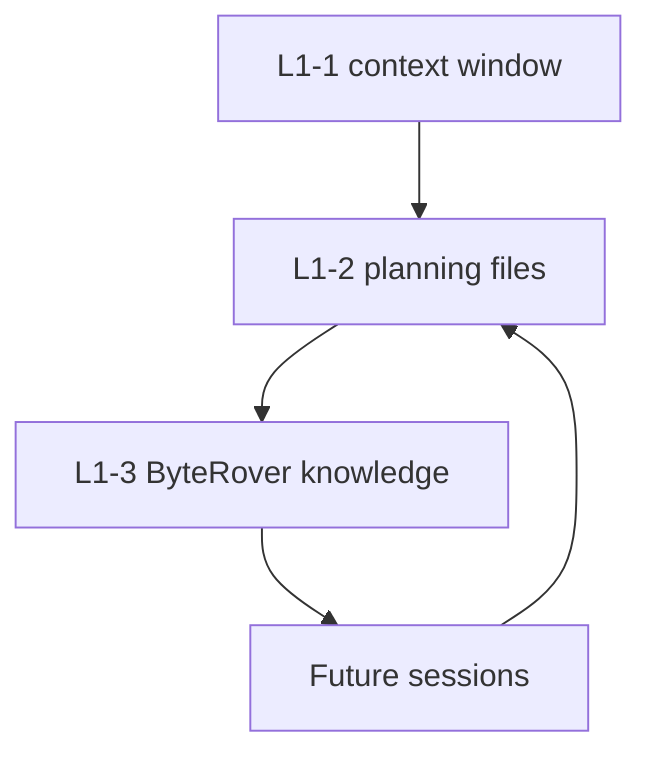

# agent-memory-stack

面向 AI 编程 agent 的持久记忆规则，让上下文不再只存在于单个聊天窗口里。

<p>
  
  
  
</p>

<!-- README-I18N:START -->
<p>
  <a href="./README.md">English</a> | <strong>简体中文</strong>
</p>
<!-- README-I18N:END -->

> [!NOTE]
> 本项目只发布记忆规则和脱敏配置模板。真实 planning 文件、ByteRover context tree、凭据和本机路径都必须留在 Git 之外。

## 解决什么问题

AI 编程 agent 会在 session 结束后丢失上下文。这个脚手架让 Claude Code、Codex 和 Gemini CLI 共享同一套运行模型，用于短期任务衔接和长期仓库知识沉淀。

## 包含内容

```text
agent-memory-stack/
└── global/
    ├── CLAUDE.md                    # Claude Code global router
    ├── AGENTS.md                    # Codex global router
    ├── GEMINI.md                    # Gemini CLI global router
    └── claude-settings.example.json # Claude Code SessionStart hook example
```

三份 router 文件正文保持一致，只使用不同的宿主专属 H1 标题。

## 记忆模型

| 层级 | 目的 | 存储位置 |
| :--- | :--- | :--- |
| L1-1 | 当前 session 上下文 | 运行时上下文窗口 |
| L1-2 | 任务状态和 session handoff | `task_plan.md`, `progress.md`, `findings.md` |
| L1-3 | 持久仓库决策和发现 | ByteRover `.brv/context-tree/` |



## 快速开始

复制与你运行时匹配的 router 文件：

```powershell
# Claude Code
Copy-Item .\global\CLAUDE.md $HOME\.claude\CLAUDE.md

# Codex
Copy-Item .\global\AGENTS.md $HOME\.codex\AGENTS.md

# Gemini CLI
Copy-Item .\global\GEMINI.md $HOME\.gemini\GEMINI.md
```

对于 Claude Code，合并真实 settings 前先审查 `global/claude-settings.example.json` 里的 SessionStart hook。

## 运行规则

- 当当前目录是 L1 仓库时，session 启动时加载 planning 上下文。
- Web、API 和第三方内容不要写进 `task_plan.md`；应写入 `findings.md`。
- 将 `progress.md` 视为 append-only 项目历史。
- 只通过显式沉淀流程把持久决策写入 ByteRover。
- 使用 Git worktree 时，要有意识地合并 planning 文件，并避免并发写入 ByteRover。

## 依赖

- `planning-with-files`，用于 hook 驱动的 planning-file 上下文。
- ByteRover CLI (`brv`)，用于 L1-3 长期层。
- 能在启动时加载对应 router 文件的运行时。

## 隐私边界

不要发布：

- 真实 `task_plan.md`、`progress.md` 或 `findings.md` 文件。
- `.brv/` context tree 或 `.brv` worktree 指针文件。
- Provider 环境变量、API key 或 auth token。
- 机器专属路径或账号标识。
