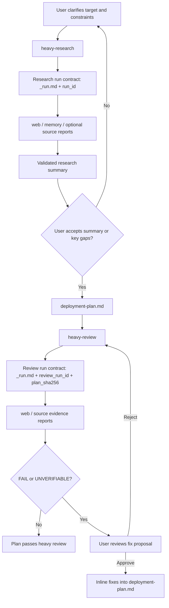

# agent-workflows

Heavy research and review workflows for agent-assisted deployment planning.

> [!NOTE]
> This project publishes the workflow Skills and redacted contracts only. Runtime `.workflows/` sessions, deployment plans from real projects, review reports, and local planning files stay outside Git.

## What It Provides

```text
agent-workflows/
└── skills/
    ├── heavy-research/
    │   ├── SKILL.md
    │   ├── references/
    │   └── scripts/
    └── heavy-review/
        ├── SKILL.md
        ├── references/
        └── scripts/
```

| Skill | Role | Output |
| :--- | :--- | :--- |
| `heavy-research` | Planner | `.workflows/<session>/deployment-plan.md` |
| `heavy-review` | Reviewer | Inline fixes back into the same deployment plan after user approval |

## Workflow



## Core Contracts

- `heavy-research` only triggers on the exact phrase `准备开始进行重型调研`.
- `heavy-review` only triggers on the exact phrase `准备开始进行重型审查`.
- Both Skills use file contracts rather than chat summaries as the source of truth.
- Research reports are tied to a `run_id`; stale or mismatched reports are ignored.
- Review reports are tied to both `review_run_id` and `plan_sha256`; old reports cannot be reused after the plan changes.
- Source-code research is included only when `_run.md` explicitly enables `source`.
- Review routes are fieldized through `statement`, `evidence_route`, `risk_dimensions`, and `risk_hint`.
- Review aggregation treats `FAIL > UNVERIFIABLE > PASS`; unverified work never silently passes.

## Dependencies

- An agent runtime that can read local Skills and write files in the repository.
- Web search/fetch tooling for the web route.
- Local file read/search tooling for source routes.
- Optional ByteRover/PWF context for memory-backed research.

## Privacy Boundary

Do not publish:

- Real `.workflows/` session directories.
- Real deployment plans or review reports from private projects.
- Project-specific source excerpts that are not already public.
- Local planning files or ByteRover context trees.
