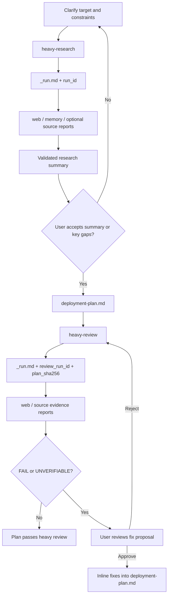

# agent-workflows

Heavy research and review skills for deployment plans that need evidence, traceability, and a human approval gate.

<p>
  
  
  
</p>

> [!NOTE]
> This project publishes the workflow skills and redacted contracts only. Runtime `.workflows/` sessions, deployment plans from real projects, review reports, and local planning files stay outside Git.

## What It Solves

Complex deployments often fail because research, source evidence, risk review, and user approval are scattered across chat history. These skills force that work into explicit files, hashes, run IDs, and review gates.

## What's Included

```text
agent-workflows/
└── skills/
    ├── heavy-research/
    │   ├── SKILL.md
    │   ├── references/
    │   └── scripts/
    └── heavy-review/
        ├── SKILL.md
        ├── references/
        └── scripts/
```

| Skill | Trigger | Role | Output |
| :--- | :--- | :--- | :--- |
| `heavy-research` | `准备开始进行重型调研` | Planner | `.workflows/<session>/deployment-plan.md` |
| `heavy-review` | `准备开始进行重型审查` | Reviewer | Inline fixes back into the same deployment plan after user approval |

## Workflow



## Core Contracts

- Both skills trigger only on exact phrases.
- File contracts are the source of truth; chat summaries are not.
- Research reports are tied to `run_id`; stale reports are ignored.
- Review reports are tied to `review_run_id` and `plan_sha256`; old reports cannot be reused after the plan changes.
- Source-code research is included only when `_run.md` explicitly enables `source`.
- Review routes are fieldized through `statement`, `evidence_route`, `risk_dimensions`, and `risk_hint`.
- Review aggregation treats `FAIL > UNVERIFIABLE > PASS`; unverified work never silently passes.

## Dependencies

- An agent runtime that can read local skills and write repository files.
- Web search/fetch tooling for the web route.
- Local read/search tooling for source routes.
- Optional ByteRover/PWF context for memory-backed research.

## Privacy Boundary

Do not publish:

- Real `.workflows/` session directories.
- Real deployment plans or review reports from private projects.
- Project-specific source excerpts that are not already public.
- Local planning files or ByteRover context trees.
