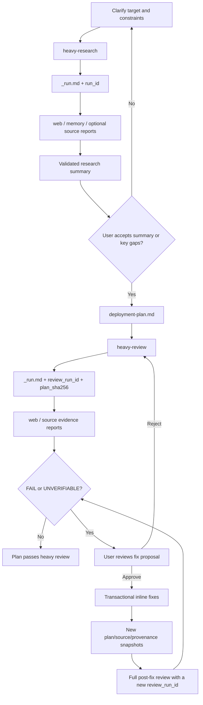

# agent-workflows

Heavy research and review skills for deployment plans that need evidence, traceability, and a human approval gate.

<p>
  
  
  
</p>

<!-- README-I18N:START -->
<p>
  <strong>English</strong> | <a href="./README.zh-CN.md">简体中文</a>
</p>
<!-- README-I18N:END -->

> [!NOTE]
> This project publishes the workflow skills and redacted contracts only. Real `.workflows/` sessions and private deployment evidence must not be published. Repository planning files follow the target repository's Agent Markdown, `.gitignore`, sensitivity rules, and explicit user authorization rather than a universal "never commit" rule.

## What It Solves

Complex deployments often fail because research, source evidence, risk review, and user approval are scattered across chat history. These skills force that work into explicit files, hashes, run IDs, and review gates.

## What's Included

```text
agent-workflows/
└── skills/
    ├── heavy-research/
    │   ├── SKILL.md
    │   ├── references/
    │   └── scripts/
    └── heavy-review/
        ├── SKILL.md
        ├── references/
        └── scripts/
```

| Skill | Trigger | Role | Output |
| :--- | :--- | :--- | :--- |
| `heavy-research` | `准备开始进行重型调研` / `准备开始进行 Heavy Research` | Planner | `.workflows/<session>/deployment-plan.md` |
| `heavy-review` | `准备开始进行重型审查` / `准备开始进行 Heavy Review` | Reviewer | Inline fixes back into the same deployment plan after user approval |

## Workflow



## Core Contracts

- Both skills trigger only on exact phrases.
- File contracts are the source of truth; chat summaries are not.
- Research reports are tied to `run_id`; stale reports are ignored.
- Review reports are tied to `review_run_id` and `plan_sha256`; old reports cannot be reused after the plan changes.
- Source-code research is included only when `_run.md` explicitly enables `source`.
- Review routes bind a safe summary to exact plan bytes through `statement_sha256` and `plan_locator`, plus route, risk, and freshness fields.
- Review aggregation treats `FAIL > UNVERIFIABLE > PASS`; unverified work never silently passes.
- Review summaries, exact fix specifications, and user decisions are persisted and hash-bound.
- `fix-state: prepared` is not proof that the plan was changed; resume the transactional apply helper idempotently before any post-fix review.
- An inline fix never ends the workflow: the modified plan must pass a new full review before the fix state becomes verified.

## Dependencies

- An agent runtime that can read local skills and write repository files.
- Web search/fetch tooling for the web route.
- Local read/search tooling for source routes.
- Optional ByteRover/PWF context for memory-backed research.

## Privacy Boundary

Do not publish:

- Real `.workflows/` session directories.
- Real deployment plans or review reports from private projects.
- Project-specific source excerpts that are not already public.
- Local planning files or ByteRover context trees unless the target repository explicitly requires them to be tracked and they have passed sensitivity checks.
