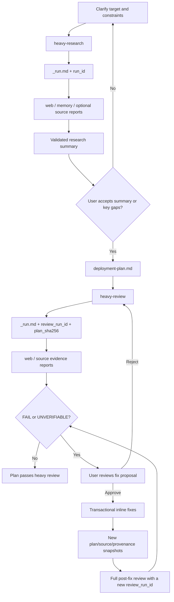

# agent-workflows

面向部署方案的重型调研和重型审查 skills，用文件证据、可追踪契约和人工批准闸门提高可靠性。

<p>
  
  
  
</p>

<!-- README-I18N:START -->
<p>
  <a href="./README.md">English</a> | <strong>简体中文</strong>
</p>
<!-- README-I18N:END -->

> [!NOTE]
> 本项目只发布工作流 skills 和脱敏契约。真实 `.workflows/` session 与私有部署证据不得发布。仓库 planning 文件是否跟踪，应依据目标仓库 Agent Markdown、`.gitignore`、敏感内容规则和用户明确授权判断，而不是套用统一的“永不提交”规则。

## 解决什么问题

复杂部署经常失败，是因为调研、源码证据、风险审查和用户确认散落在聊天历史里。这两个 skills 会把这些工作固化到明确的文件、hash、run ID 和 review gate 中。

## 包含内容

```text
agent-workflows/
└── skills/
    ├── heavy-research/
    │   ├── SKILL.md
    │   ├── references/
    │   └── scripts/
    └── heavy-review/
        ├── SKILL.md
        ├── references/
        └── scripts/
```

| Skill | 触发词 | 角色 | 输出 |
| :--- | :--- | :--- | :--- |
| `heavy-research` | `准备开始进行重型调研` / `准备开始进行 Heavy Research` | Planner | `.workflows/<session>/deployment-plan.md` |
| `heavy-review` | `准备开始进行重型审查` / `准备开始进行 Heavy Review` | Reviewer | 用户批准后 inline 修复同一份部署计划 |

## 工作流



## 核心契约

- 两个 skills 只响应精确触发词。
- 文件契约是真源；聊天摘要不是。
- 调研报告绑定 `run_id`；陈旧报告会被忽略。
- 审查报告绑定 `review_run_id` 和 `plan_sha256`；计划变更后旧报告不能复用。
- 只有 `_run.md` 显式启用 `source` 时，才纳入源码调研。
- 审查路线用 `statement_sha256` 与 `plan_locator` 把安全摘要绑定到精确 plan bytes，并附路线、风险和时效字段。
- 审查聚合遵守 `FAIL > UNVERIFIABLE > PASS`；无法验证的工作不会被静默当作通过。
- 综合报告、精确修复规格和用户决定都会持久化并绑定 hash。
- `fix-state: prepared` 不代表 plan 已修改；开始 post-fix review 前必须幂等续跑事务 apply helper。
- inline fix 不会结束工作流；修改后的 plan 必须用新 `review_run_id` 完整复审通过，fix state 才能标记 verified。

## 依赖

- 能读取本地 skills 并写入仓库文件的 agent 运行时。
- 用于 web 路线的 Web search/fetch 工具。
- 用于 source 路线的本地 read/search 工具。
- 可选的 ByteRover/PWF 上下文，用于记忆支撑的调研。

## 隐私边界

不要发布：

- 真实 `.workflows/` session 目录。
- 私有项目的真实部署计划或审查报告。
- 尚未公开的项目源码摘录。
- 本地 planning 文件或 ByteRover context tree；但若目标仓库明确要求跟踪且已通过敏感内容检查，可按仓库 policy 处理。
