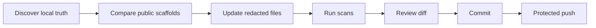

# sharing-studio-sync

A guarded publication workflow for keeping this public hub aligned with local source-of-truth scaffolds.

<p>
  
  
  
</p>

> [!WARNING]
> This project is a publication workflow, not a backup tool. It must never publish private notes, real Todoist tasks, credentials, runtime state, or local planning files.

## What It Solves

The live scaffolds used by local agents can move faster than the public `sharing-studio` repository. This skill turns publishing into a repeatable pipeline with source discovery, redaction, checks, and protected push review.

## What's Included

```text
sharing-studio-sync/
└── skill/
    ├── SKILL.md
    └── scripts/
        └── preflight-sharing-studio-sync.ps1
```

## Sync Scope

| Domain | Public Target |
| :--- | :--- |
| L1 memory rules | `projects/agent-memory-stack/` |
| L2 Second Brain scaffold | `projects/second-brain-scaffold/` |
| GTD Todoist harness | `projects/gtd-todoist/` |
| Heavy research and review workflows | `projects/agent-workflows/` |
| Publication workflow | `projects/sharing-studio-sync/` |

## Workflow



## Safety Checks

- Verify expected public project directories exist.
- Confirm source-of-truth router and skill paths are available.
- Detect accidental staging of root-level protected paths.
- Keep `.workflows/`, PWF files, `.brv`, root agent state, and credentials out of outgoing commits.

## Privacy Boundary

Do not publish:

- Real `wiki/`, `daily/`, `raw/`, `index.md`, or personal vault content.
- Todoist task titles, activity logs, account IDs, tokens, or webhook targets.
- `task_plan.md`, `progress.md`, `findings.md`, `.workflows/`, `.brv/`, or runtime agent state.
- Repo-root `AGENTS.md`, `CLAUDE.md`, `GEMINI.md`, `.claude/`, `.agents/`, `.codex/`, and `.gemini/`.
- Local absolute paths such as real user profiles or cloud-drive locations.

Use placeholders such as `<vault-path>`, `<agent-workspace>`, `<TELEGRAM_USER_ID>`, and `<BOT_ACCOUNT>` instead.
