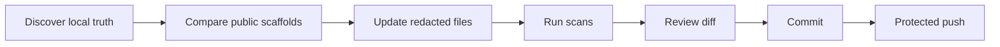

# sharing-studio-sync

一个受保护的发布工作流，用来让这个公开 hub 与本机真源脚手架保持一致。

<p>
  
  
  
</p>

<!-- README-I18N:START -->
<p>
  <a href="./README.md">English</a> | <strong>简体中文</strong>
</p>
<!-- README-I18N:END -->

> [!WARNING]
> 本项目是发布工作流，不是备份工具。它绝不能发布私人笔记、真实 Todoist 任务、凭据、运行时状态或本地 planning 文件。

## 解决什么问题

本地 agent 实际使用的脚手架可能比公开 `sharing-studio` 仓库更新得更快。这个 skill 把发布变成可重复流水线：真源发现、脱敏、检查和受保护 push 审查。

## 包含内容

```text
sharing-studio-sync/
└── skill/
    ├── SKILL.md
    └── scripts/
        └── preflight-sharing-studio-sync.ps1
```

## 同步范围

| 领域 | 公开目标 |
| :--- | :--- |
| L1 memory rules | `projects/agent-memory-stack/` |
| L2 Second Brain scaffold | `projects/second-brain-scaffold/` |
| GTD Todoist harness | `projects/gtd-todoist/` |
| Heavy research and review workflows | `projects/agent-workflows/` |
| 发布工作流 | `projects/sharing-studio-sync/` |

## 工作流



## 安全检查

- 验证预期的公开项目目录存在。
- 确认真源 router 和 skill paths 可用。
- 检测是否意外 staged 了根级受保护路径。
- 阻止 `.workflows/`、PWF files、`.brv`、root agent state 和 credentials 进入 outgoing commits。

## 隐私边界

不要发布：

- 真实 `wiki/`、`daily/`、`raw/`、`index.md` 或个人 vault content。
- Todoist task titles、activity logs、account IDs、tokens 或 webhook targets。
- `task_plan.md`、`progress.md`、`findings.md`、`.workflows/`、`.brv/` 或 agent 运行时状态。
- 仓库根级 `AGENTS.md`、`CLAUDE.md`、`GEMINI.md`、`.claude/`、`.agents/`、`.codex/` 和 `.gemini/`。
- 真实本机绝对路径，例如 user profiles 或 cloud-drive locations。

使用 `<vault-path>`、`<agent-workspace>`、`<TELEGRAM_USER_ID>` 和 `<BOT_ACCOUNT>` 等占位符。
